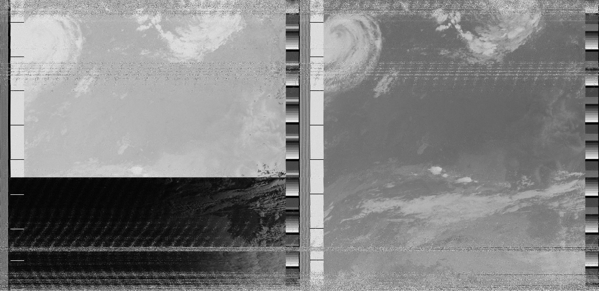

# ```apitran```
A Linux toolkit for handling signals over the automatric picture transmission (APT) protocol.

## Intro to Automatic Picture Transmission
Automatic picture transmission (APT) is an analog image transmission format developed for use on weather satellites in the 1960s. While only three modern satellites, NOAA 15, NOAA 18, and NOAA 19, transmit on the APT protocol, building a reception station is cheap and simple. The images can be quite high quality—they natively have a resolution of 4 km/px. It is reasonable to expect at least one good-quality satellite pass (and, thereby, opportunity for image downlink) per day. 

### Transmission
The transmitting antennae aboard the satellites are linearly polarized. However, the satellites spin as they orbit, creating an effectively right-circularly polarized signal. The signal has 256 levels, which are amplitude-modulated onto a 2.4 kHz subcarrier, which is then frequency-modulated onto a 137-MHz band RF carrier. The overall RF bandwidth is 34 kHz. The signal is broadcast at 37 dBm (~5 W) ERP. The specific center frequency depends on the satellite:

* NOAA 15 — 137.6200 MHz
* NOAA 18 — 137.9125 MHz
* NOAA 19 — 137.1000 MHz

### Reception
To recieve, it is normally okay to use a passive antenna with no tracking (especially if a circularly polarized antenna is used). Some common antenna choices:

* Quadrifilar helix (QFH)
* Double crossed dipoles

The most common choice of receiver is probably the RTL-SDR. There are multiple options on the software side. If you are using apitran, it means you are running Linux and so I recommend Gqrx. 

## Getting Started with ```apitran```

### Dependencies
```apitran``` requires the following packages as dependencies:

* ```sox```

And Python modules:

* ```PIL```
* ```sys```
* ```numpy```
* ```scipy```
* ```subprocess```
* ```argparse```


### Installation
Clone ```apitran``` to your directory of choice. 

### Testing ```apitran```
To test ```apitran``` once installed, simply run:

```
./apitran -t
```
or
```
./apitran --test
```
```apitran``` will go through each of its functions and ensure they are working as expected. If a function is not working as expected, it will report to ```stdout```. If you receive no output, ```apitran``` is fully functional. 

## Using ```apitran```
Here, we will go through all of the functions available to ```apitran```. In general, these flags can be stacked.

### ```-d --decode input_filename```
Use this flag to decode a .wav recording of an APT signal. The .wav can be any number of channels, at any samplerate—the software will do any necessary conversions. The decoded image will be displayed using your default image viewer. Unless output filename is specified using ```-o```, this output will not be saved automatically. 

### ```-o --output output_filename```
Given a flag which creates output, this flag can be used to override the default output location. 

## Examples

### Decoded from a 2-channel, 48000 Hz .wav

